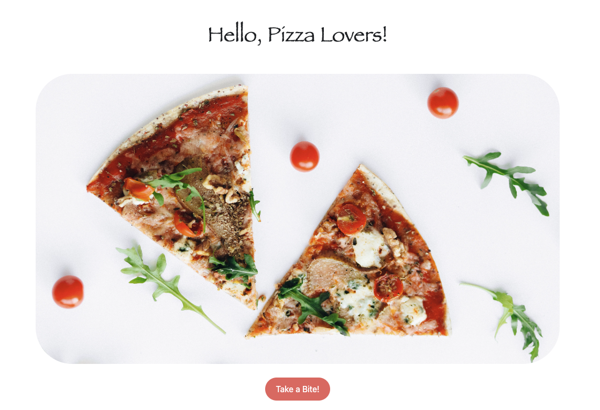

# Food Service Website
# Brand: Jenny's Za

## About The Project

This project entails online shop for users to search various pizza options! The company I created is called "Jenny's Za". My website features two pages (Home and Products Search Page).

## Project Goals

- Create a food service site that lists pizza data.
- Create an intuitive flow for user experience.
- Simple, modern aesthetic.


### Built With

* HTML5
* CSS3
* Bootstrap
* JavaScript

### Requirements

1. A Home Page:
- Highlights simple organization + branding
- Links to Products Search Page

2. Products Search Page:
- Search engine:
            - Search by View All dropdown
            - Search by Category dropdown
            - Search by Vegetarian vs Meat-eater dropdown

- JSON Data is linked to file named: data.js

### Interesting Piece of Code

1. HTML + JavaScript to Change Image




2. In Pages > `mountains.html`:


  ```html
  <div class="image-container">
    
  </div>

  <button id="myButton">Take a Bite!</button>
  ```
  3. In CSS Folder > `style.css`:

  ```javascript

 // Change the photo when click "take a bite!"
document.addEventListener('DOMContentLoaded', function() {
    let button = document.getElementById('myButton');
    let image = document.getElementById('myImage');
    let defaultImage = 'images/za.jpg';
    let newImage = 'images/bite.jpg';

    button.addEventListener('click', function() {
      if (image.src.includes(defaultImage)) {
        image.src = newImage;
      } else {
        image.src = defaultImage;
      }
    });
  });
  ```

  ## Screenshots of Webpages

  1. 


  2. 


  3. 


  4. 

## Contact

Your Name - @jenaecodes

Project Link: [https://github.com/jenaecodes/Jenny-s-Za-Pizza-Website]